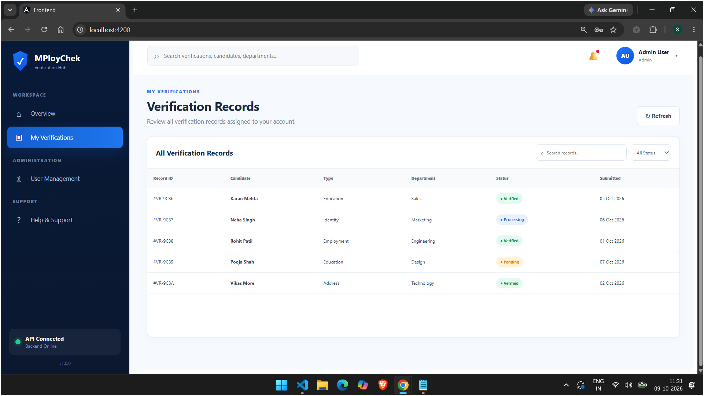

<<<<<<< HEAD
# MPloyChek — Employment Verification SPA

An Angular 12+ single-page application (SPA) concept for employment verification. The interface includes a role-based login, user-specific verification records, an administrator user-management area, and a configurable API delay to demonstrate asynchronous processing.

> This repository is a demonstration project. The included sample data and mock authentication are for development/evaluation only and must not be treated as production security.

## Reference UI screenshots

Keep the six supplied reference images in a `screenshots/` folder beside this README:

```text
screenshots/
├── Login Page.png
├── Dashbord 1.png
├── DashBord 2.png
├── Verification.png
├── User Manegement.png
└── Help and Support.png
```

### Login page


### Dashboard overview — top


### Dashboard overview — records section


### My verifications


### User management


### Help and support


## Application requirements and features

### 1. Role-based login

- Login form with **User ID**, **Password**, and **Role**.
- Supported roles: **General User** and **Admin**.
- Use a dummy API to accept login details and return a user/session response.
- Sample storage can be local mock data, XML, MongoDB, or AWS DynamoDB.
- Show validation and clear success/error feedback.
- Demo login is not production authentication; real deployments should use secure password hashing, HTTPS, server-side authorization, and appropriate session/token handling.

### 2. Logged-in dashboard and verification records

- Display the logged-in user's details, role, account status, and access level.
- Call an API service to retrieve verification records.
- Render records in a searchable/filterable table.
- Use dummy records to demonstrate record-level access: a General User sees only records assigned to that user; an Admin can access platform records.
- Show loading, empty, success, and API error states.

### 3. Admin user management

- Only the Admin role should see the user-management feature.
- Load users from a user service and show them in a table.
- Demonstrate user actions such as editing details, activating/deactivating an account, and deleting a user, using mock data or a connected backend.
- Enforce role checks in the application UI and, in a real deployment, on the server too.

### 4. Configurable API delay and asynchronous processing

- Add a configurable delay parameter to a dummy API endpoint, for example `?delay=1800`.
- Use the delay to demonstrate asynchronous API requests and processing indicators.
- On dashboard load, request the current profile, verification records, and (for Admin) user data through services.
- Use Angular/RxJS patterns such as `HttpClient`, Observables, `delay`, `catchError`, and `finalize` where appropriate.
- Keep loading indicators and API status feedback visible while requests are in progress.

### 5. Modular Angular architecture

Organize code into components, models, and services rather than placing all logic in one component.

```text
src/
└── app/
    ├── app.component.ts
    ├── app.component.html
    ├── app.component.css
    ├── app.module.ts
    ├── models/
    │   ├── user.model.ts
    │   ├── verification-record.model.ts
    │   ├── dashboard-stats.model.ts
    │   └── api-response.model.ts
    ├── services/
    │   ├── api.service.ts
    │   ├── auth.service.ts
    │   ├── toast.service.ts
    │   ├── user.service.ts
    │   └── verification.service.ts
    └── components/
        ├── login/
        ├── sidebar/
        ├── header/
        ├── overview/
        ├── verifications/
        ├── user-management/
        ├── help/
        ├── edit-user-modal/
        ├── toast/
        └── loading-overlay/
```

Suggested responsibilities:

- `ApiService`: shared HTTP configuration and API helpers.
- `AuthService`: login/logout, current-user state, and role checks.
- `UserService`: retrieve and manage users.
- `VerificationService`: retrieve verification records and dashboard counts.
- `ToastService`: success/error/information notifications.
- `models/`: typed interfaces for API payloads and application data.
- `components/`: focused UI areas, each with its own template and styles.

## UI and accessibility goals

- Use a distinctive, consistent MPloyChek visual identity.
- Keep page spacing consistent with a global CSS reset (`margin: 0`, `padding: 0`, `box-sizing: border-box`).
- Keep the dashboard sidebar fixed while the main content panel scrolls.
- Keep the login view fitted to the viewport and responsive on smaller screens.
- Use clear status badges for Verified, Processing, and Pending records.
- Provide accessible form labels, keyboard-friendly controls, and visible focus states.
- Use responsive layouts for desktop, tablet, and mobile widths.

## Technology stack

- Angular 12 or later
- TypeScript
- Angular Router for page navigation (if routes are used)
- Angular `HttpClient` for API requests
- RxJS for asynchronous streams and request state
- Node.js with Express for an optional dummy REST API
- Optional persistence: local mock data, XML, MongoDB, or AWS DynamoDB

## Requirements

Install a Node.js version compatible with the Angular version in the project. Check your environment:

```bash
node --version
npm --version
ng version
```

## Run the Angular frontend

Run commands from the project root (the folder containing `package.json` and `angular.json`):

```bash
npm install
ng serve --open
```

The app normally opens at `http://localhost:4200/`.

If a `start` script is configured in `package.json`, you can also use:

```bash
npm start
```

## Generate files with Angular CLI

Examples for an NgModule-based application:

```bash
ng generate component components/login --skip-tests
ng generate component components/sidebar --skip-tests
ng generate component components/header --skip-tests
ng generate component components/overview --skip-tests
ng generate component components/verifications --skip-tests
ng generate component components/user-management --skip-tests
ng generate component components/help --skip-tests
ng generate component components/edit-user-modal --skip-tests
ng generate component components/toast --skip-tests
ng generate component components/loading-overlay --skip-tests

ng generate service services/api
ng generate service services/auth
ng generate service services/toast
ng generate service services/user
ng generate service services/verification

ng generate interface models/user.model
ng generate interface models/verification-record.model
ng generate interface models/dashboard-stats.model
ng generate interface models/api-response.model
```

> Depending on the Angular CLI version, generated components may be standalone by default. If your project uses `AppModule`, generate or configure components for NgModule declarations and verify `app.module.ts`.

## Optional dummy Node.js API

A simple Express API can expose endpoints such as:

- `POST /api/auth/login` — validate demo credentials and return a role/user response.
- `GET /api/users?delay=1800` — return users for Admin and simulate processing delay.
- `GET /api/verifications?userId=user1&delay=1800` — return verification records according to access rules.
- `GET /api/dashboard/stats?delay=1800` — return dashboard counts.

These are endpoint suggestions, not claims that a backend is already implemented. Apply authorization and validate parameters on the server. Never rely only on hiding admin buttons in Angular.

## Suggested evaluation checklist

- [ ] Login validates User ID, Password, and selected role.
- [ ] General User and Admin experiences differ according to role.
- [ ] Logged-in profile details are displayed.
- [ ] Verification records are loaded through a service and shown in a table.
- [ ] General User only receives assigned records.
- [ ] Admin can view and manage users.
- [ ] API delay is configurable and loading indicators show asynchronous work.
- [ ] API errors and empty responses are handled.
- [ ] Components, services, and models are modular and typed.
- [ ] Layout is responsive and matches the reference UI.
- [ ] README screenshots are stored under `screenshots/`.

## Security reminder

Mock credentials, local storage, and dummy records are appropriate only for a demo. For production, use a backend with secure authentication, hashed passwords, server-side role/access checks, validated inputs, and secure database configuration. Do not commit secrets or real personal verification data to source control.
=======
# Mploychek-Employment-Verification
>>>>>>> d885b65cdd9f12630de9996a8efa231fc6b374c0
